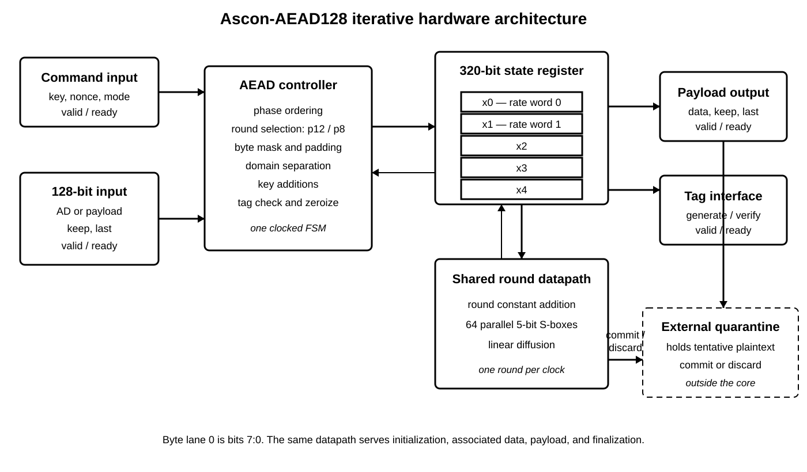
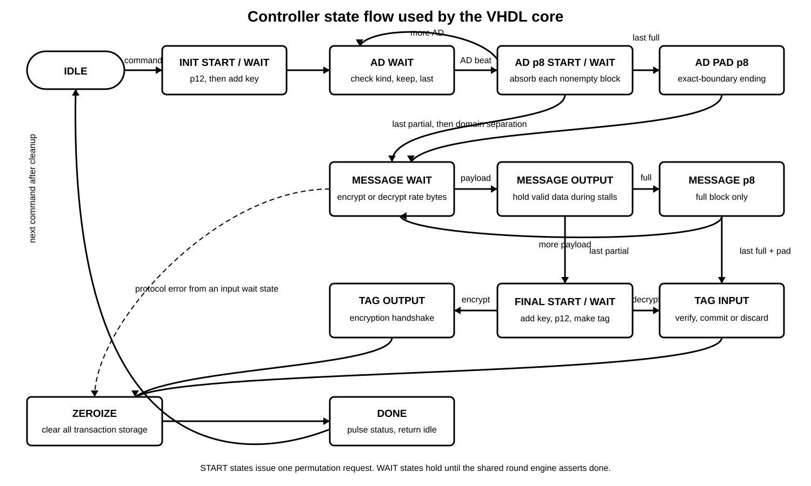

# Ascon-AEAD128 in VHDL

This repository implements the final NIST Ascon-AEAD128 algorithm in VHDL-2008.
The design targets the Nexys A7 100T and uses a 128-bit ready/valid stream. It
supports encryption, decryption, associated data, partial blocks, and messages
of arbitrary byte length.

The code follows NIST SP 800-232. That matters because the final standard uses
little-endian byte mapping, a new initialization value, and a 128-bit rate.
Older Ascon-128 and Ascon-128a examples are useful architecture references, but
their test vectors are not byte-compatible with this core.

The current portable verification passes all 1,089 official known-answer
vectors in encryption and decryption. Vivado synthesis and board testing are
prepared but have not been run on this Mac. See
[verification status](docs/verification_status.md) for the exact boundary.

## Repository layout

```text
rtl/                         synthesizable VHDL-2008
  ascon_pkg.vhd              round, byte-mask, and padding functions
  ascon_permutation.vhd      one-round-per-clock permutation engine
  ascon_aead128_core.vhd     streaming AEAD controller
  ascon_demo_top.vhd         Nexys A7 switch-and-LED demonstration
verification/
  model/                     independent Python reference model and tests
  cocotb/                    direct RTL and generated-netlist tests
  vhdl/                      self-checking TextIO testbench for XSim
  vectors/                   generated official KAT file and provenance
vivado/                      project, simulation, implementation Tcl, and XDC
docs/diagrams/               original black-and-white SVG diagrams
paper/                       editable report source and rendered paper
```

## Architecture

The core stores the 320-bit state as five 64-bit words. One combinational Ascon
round is reused on every clock. The controller requests 12 rounds for
initialization and finalization and 8 rounds while processing associated data
and full payload blocks.



The controller states map directly to hardware actions. Separate start states
issue one permutation request, and wait states hold until the iterative engine
finishes. Every normal completion, protocol error, and tag result enters
`ST_ZEROIZE` before `ST_DONE`. That state clears the key, permutation state,
mode and phase flags, buffered payload, keep mask, last flag, tag, and stored
authentication result. The diagram is original to this implementation.



This version does not include masking, redundant execution, or a fault sensor.
Those are possible later additions. The present design focuses on a readable,
testable baseline.

## Core interface

All inputs and outputs are synchronous to `clk_i`. Reset is active high and
synchronous.

| Group | Signal | Direction | Meaning |
|---|---|---:|---|
| Clock | `clk_i`, `rst_i` | in | Clock and synchronous reset |
| Command | `cmd_valid_i`, `cmd_ready_o` | in, out | Starts one transaction |
| Command | `cmd_decrypt_i` | in | `0` encrypts, `1` decrypts |
| Command | `key_i[127:0]`, `nonce_i[127:0]` | in | 128-bit key and nonce |
| Input | `in_valid_i`, `in_ready_o` | in, out | Ordered stream handshake |
| Input | `in_kind_i` | in | `0` associated data, `1` payload |
| Input | `in_data_i[127:0]` | in | Up to 16 input bytes |
| Input | `in_keep_i[15:0]` | in | One bit per valid byte lane |
| Input | `in_last_i` | in | Final beat of the current phase |
| Decrypt tag | `tag_in_valid_i`, `tag_in_ready_o`, `tag_in_i` | in, out, in | Tag presented for checking |
| Output | `out_valid_o`, `out_ready_i` | out, in | Payload stream handshake |
| Output | `out_data_o`, `out_keep_o`, `out_last_o` | out | Ciphertext or tentative plaintext |
| Encrypt tag | `tag_out_valid_o`, `tag_out_ready_i`, `tag_out_o` | out, in, out | Generated authentication tag |
| Status | `busy_o`, `done_o`, `error_o` | out | Transaction state and protocol error |
| Authentication | `auth_valid_o`, `auth_ok_o` | out | Decryption tag result |
| Release | `commit_o`, `discard_o` | out | External plaintext-buffer decision |

### Byte order and keep masks

Byte lane 0 is `in_data_i(7 downto 0)` and uses `in_keep_i(0)`. If the first
four bytes are `11 22 33 44`, the low 32 bits of `in_data_i` are `44332211` and
`in_keep_i` is `000F`.

Keep bits must be contiguous from lane 0. `0000`, `0001`, `0003`, and `FFFF`
are valid. `0005` is invalid. A non-final beat must have `FFFF`. Empty
associated-data or payload phases are represented by one terminal beat with
`keep=0000` and `last=1`.

### Transaction order

```text
command -> associated-data beat(s) -> payload beat(s) -> tag -> done
             kind=0, last=1           kind=1, last=1
```

Associated data must finish before payload starts. A handshake occurs on a
rising edge when both valid and ready are high. An output remains unchanged
while its valid signal is high and its ready input is low. A malformed keep
mask or phase order raises `error_o`, passes through the same zeroization state
used by normal completion, and ends the transaction.

### Safe decryption contract

Decrypted bytes are tentative until the tag has been checked. The surrounding
system must store `out_data_o` in a quarantine buffer. It may release that data
only after `commit_o`. If authentication fails, the core pulses `discard_o`,
does not pulse `commit_o`, and clears its state and stored key.

The core intentionally does not contain an unbounded plaintext buffer. This
keeps the reusable cryptographic block independent of maximum message length,
but it makes the external commit/discard rule part of the security boundary.

## Portable verification

Create a Python environment, install the pinned packages, and fetch the pinned
official vectors:

```sh
python3 -m venv .venv
.venv/bin/python -m pip install -r verification/requirements.txt
.venv/bin/python verification/fetch_vectors.py
```

With GHDL available on `PATH`:

```sh
make PYTHON=.venv/bin/python model-test
make PYTHON=.venv/bin/python permutation-test
make PYTHON=.venv/bin/python ghdl-test
make PYTHON=.venv/bin/python full-kat
make GHDL=ghdl vhdl-textio-test
```

The permutation test checks the hardware state after every round of p12 and p8,
not only the final permutation output. The TextIO target runs all 1,089 vectors
in encryption and decryption and writes its two result files under
`build/ghdl-textio`.

The normal GHDL run selects byte-boundary cases. `full-kat` runs all 1,089
official cases in both directions. The cocotb suite also checks output stalls,
delayed tags, authentication-result timing, reset in each major phase,
malformed masks, held extra beats, phase ordering, zeroization, a clean command
after failure, deterministic messages up to 80 bytes, tag corruption, and
changed key, nonce, associated data, and ciphertext.

To test the synthesized Verilog representation with the installed Icarus and
Verilator tools:

```sh
make GHDL=ghdl synth-verilog
make GHDL=ghdl PYTHON=.venv/bin/python iverilog-test
make GHDL=ghdl PYTHON=.venv/bin/python verilator-test
make GHDL=ghdl PYTHON=.venv/bin/python full-icarus-kat
make GHDL=ghdl PYTHON=.venv/bin/python full-verilator-kat
```

The first two simulator targets are short smoke runs when `KAT_LIMIT=8` is set,
as it is in CI. The two `full-*` targets run every official vector manually.
The generated Verilog is a build artifact. The maintained source is VHDL.

### Docker fallback on macOS

The repository pins `ghdl/ghdl:6.0.0-mcode-ubuntu-24.04` in the verification
Dockerfile. Start Docker Desktop, then run:

```sh
docker build --platform linux/amd64 -f verification/Dockerfile -t ascon-vhdl-verify .
docker run --rm --platform linux/amd64 ascon-vhdl-verify
```

The image copies the complete repository and its default command runs the model,
per-round permutation test, direct VHDL smoke suite, full TextIO bench, and both
generated-netlist smoke suites. The local Docker daemon was not running during
the September 17 verification, so the corrected image definition is prepared
but not locally exercised. GitHub Actions runs the same paths on Ubuntu.

## Vivado 2023.2

Vivado is not installed on this Mac. Run these commands on a Windows or Linux
machine with Vivado 2023.2 on `PATH`:

```sh
vivado -mode batch -source vivado/create_project.tcl
vivado -mode batch -source vivado/run_sim.tcl
vivado -mode batch -source vivado/run_impl.tcl
```

The project script selects `xc7a100tcsg324-1`, VHDL-2008, the demonstration
top level, and the 10 ns clock constraint. The simulation writes:

- `build/vivado/simulation/simulation_results.txt`, with lengths, expected and
  actual values, authentication result, cycle count, and PASS/FAIL;
- `build/vivado/simulation/simulation_vectors.txt`, stable pipe-delimited input,
  output, status, and latency records.

`run_sim.tcl` copies both files from the generated XSim directory into that
predictable location. The implementation script writes post-synthesis and
post-route utilization, timing, RAM, power, clock, clock-network, warning, and
routed-checkpoint files under `build/vivado/reports`. It archives the bitstream
as `build/vivado/artifacts/ascon_demo_top.bit`. The batch run fails if either
run is incomplete, setup slack is negative, the bitstream is absent, or Vivado
reports a critical warning.

After simulation and implementation, create the paper metrics file with:

```sh
make PYTHON=python summarize-results
```

The summarizer checks for all 2,178 directional results, calculates
command-to-done latency and payload throughput at 100 MHz, and records Vivado
measurements only when the implementation artifacts pass its completeness
checks. The paper builder keeps its explicit pending wording otherwise.

## Nexys A7 demonstration

Program the bitstream generated by `run_impl.tcl`. Press the upper button to
reset. Choose a test and press the center button once.

| Control | Function |
|---|---|
| `SW[1:0]` | `00` empty, `01` partial, `10` one full block, `11` 17-byte case |
| `SW[2]` | `0` encryption, `1` decryption |
| `SW[3]` | `0` payload display, `1` tag display |
| `SW[7:4]` | Byte index within the selected 128-bit result |
| `SW[9:8]` | Payload block index; `00` first, `01` second |
| `BTNC` | Start the selected test |
| `BTNU` | Synchronous reset |
| `LED[7:0]` | Selected result byte |
| `LED[8]` | Core busy |
| `LED[9]` | Demonstration finished |
| `LED[10]` | Authentication or encryption-vector pass |
| `LED[11]` | Authentication or encryption-vector fail |
| `LED[12]` | Protocol error |

The four compiled-in values come from the pinned official KAT file. The XDC is
limited to the used pins and follows Digilent's Nexys A7 100T master XDC.

## References

- [NIST SP 800-232, Ascon-Based Lightweight Cryptography Standards for Constrained Devices](https://csrc.nist.gov/pubs/sp/800/232/final)
- [Official Ascon specification and software](https://github.com/ascon/ascon-c)
- [Digilent Nexys A7 100T master XDC](https://github.com/Digilent/digilent-xdc/blob/master/Nexys-A7-100T-Master.xdc)

No license has been selected for this repository.
